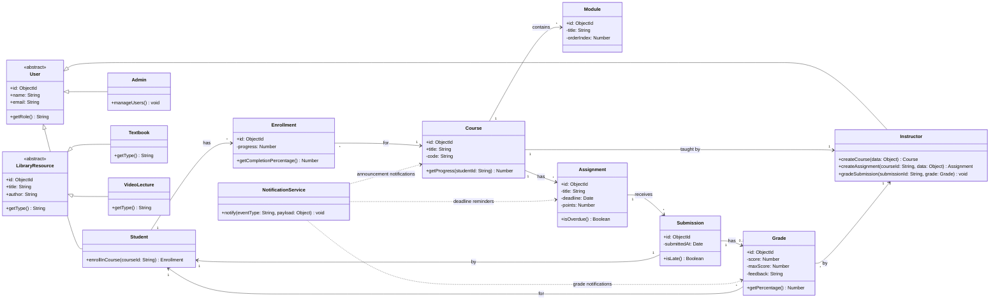

# Class Diagram — ScholarSync LMS

## Design Principles Applied

### OOP Principles
- **Encapsulation**: All classes encapsulate their data with private fields and public methods
- **Inheritance**: `User` → `Student`, `Instructor`, `Admin`; `LibraryResource` → `Textbook`, `Journal`, `VideoLecture`
- **Polymorphism**: `calculateGrade()` behaves differently per grading strategy; `getProgress()` varies by resource type
- **Abstraction**: Abstract `User` and `LibraryResource` base classes define contracts

### SOLID Principles
- **S** — Single Responsibility: Each class has one reason to change (e.g., `GradeCalculator` only handles grade math)
- **O** — Open/Closed: `LibraryResource` is open for extension (new resource types) without modifying existing code
- **L** — Liskov Substitution: Any `LibraryResource` subclass can be used wherever `LibraryResource` is expected
- **I** — Interface Segregation: `ISubmittable`, `IGradable`, `ISearchable` are small, focused interfaces
- **D** — Dependency Inversion: Services depend on repository interfaces, not concrete implementations

### Design Patterns Used
- **Factory Pattern**: `ResourceFactory` creates `Textbook`, `Journal`, or `VideoLecture` based on type
- **Singleton Pattern**: `DatabaseConnection`, `ConfigManager`

---

## Class Diagram

This diagram presents a high-level structural view of core domain entities and their primary relationships.
Implementation-level classes (factories, repositories, notifiers, enums, and helper value objects) are intentionally omitted here to keep the diagram readable.

---

## Design Patterns Summary

| Pattern | Where Applied | Purpose |
|---------|--------------|---------|
| **Factory** | `ResourceFactory` | Creates `Textbook`, `Journal`, or `VideoLecture` without exposing creation logic |
| **Singleton** | `DatabaseConnection` (not shown) | Ensures single DB connection pool |

