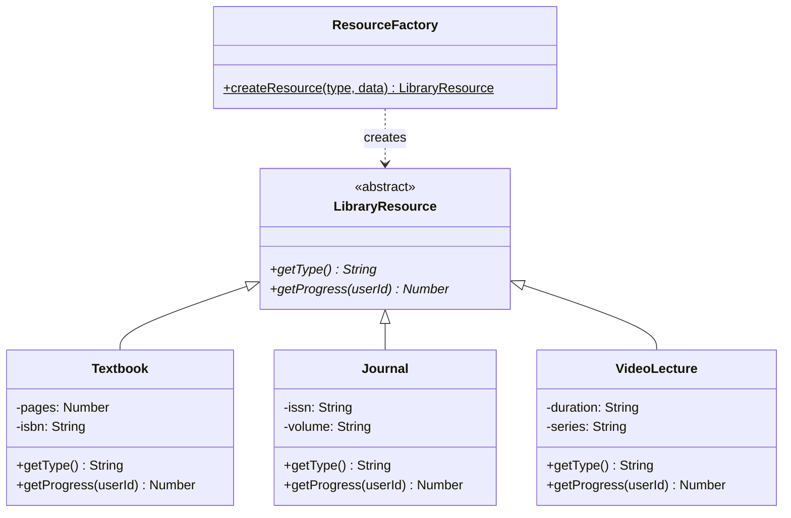

# Design Patterns — ScholarSync LMS

## Overview
This document details how each design pattern is applied in the ScholarSync system, with concrete code examples showing the implementation approach.

---

## 1. Factory Pattern — Resource Creation

**Problem**: The library contains multiple resource types (Textbook, Journal, VideoLecture) that share a common interface but have different properties and behaviors.

**Solution**: `ResourceFactory` creates the appropriate resource instance based on the `type` field.



**Pseudocode**:
```javascript
class ResourceFactory {
  static createResource(type, data) {
    switch (type) {
      case 'textbook':   return new Textbook(data);
      case 'journal':    return new Journal(data);
      case 'video':      return new VideoLecture(data);
      default: throw new Error(`Unknown resource type: ${type}`);
    }
  }
}
```

**SOLID Principle**: Open/Closed — adding a new resource type (e.g., `Podcast`) requires only adding a new class and a case, without modifying existing resource classes.

---

## 2. Singleton Pattern — Database Connection

**Problem**: Multiple database connections waste resources and create consistency issues.

**Solution**: A single shared MongoDB connection instance.

```javascript
class Database {
  static instance = null;

  static getInstance() {
    if (!Database.instance) {
      Database.instance = new Database();
    }
    return Database.instance;
  }

  async connect() {
    if (this.connection) return this.connection;
    this.connection = await mongoose.connect(process.env.MONGO_URI);
    console.log('MongoDB connected');
    return this.connection;
  }
}
```

---

## Summary Table

| Pattern | Component | OOP Principle | SOLID Principle |
|---------|-----------|--------------|-----------------|
| **Factory** | `ResourceFactory` | Polymorphism | Open/Closed |
| **Singleton** | `Database` | Encapsulation | Single Responsibility |

