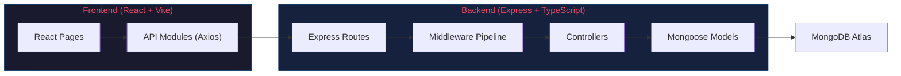
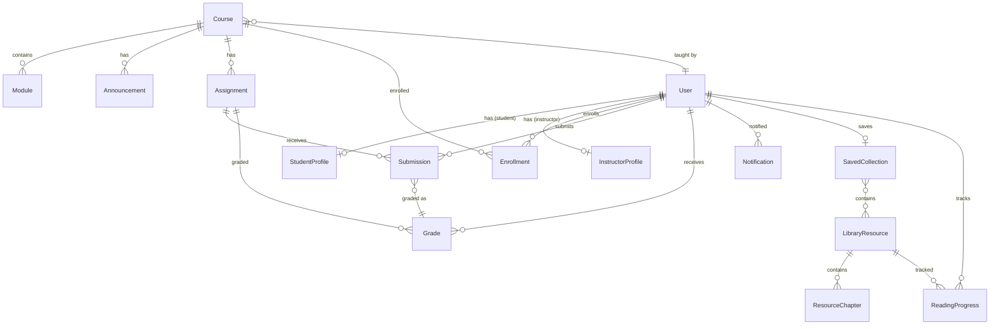

# ScholarSync — Comprehensive Codebase Analysis Report

**Group Members:** Aman, Ritesh, Dev, Ritik, Kevish

---

## 1. Project Overview

ScholarSync is a full-stack **Learning Management System (LMS)** with distinct student and instructor experiences. It provides course management, assignment workflows, grading, a digital library, and role-based dashboards — all built on a REST API backed by MongoDB.

| Metric | Value |
|---|---|
| Total source files | **80** |
| Total lines of code | **~4,597** |
| Frontend pages | **19** (13 student/public + 6 instructor) |
| Backend models | **15** Mongoose models |
| API controllers | **8** |
| API route files | **8** |
| Middleware modules | **4** |

---

## 2. Architecture



### Data Flow

```
React (Vite) → Axios API Client → Express Routes → Middleware (CORS → Rate Limit → JWT Auth → RBAC) → Controllers → Mongoose → MongoDB
```

### Key Design Decisions

| Decision | Implementation |
|---|---|
| Monorepo | Single repo with `client/` and `server/` directories |
| Auth strategy | Stateless JWT stored in `localStorage` |
| API pattern | RESTful with `/api` prefix, slug-or-id lookup |
| Styling | Tailwind CSS v4 via Vite plugin + runtime CDN config in `GlobalStyles.jsx` |
| Deployment | Vercel (both client and server separately) |

---

## 3. Tech Stack Breakdown

### Frontend (`client/`)

| Technology | Version | Purpose |
|---|---|---|
| React | 19.2.4 | UI framework |
| Vite | 8.0.1 | Build tool & dev server |
| React Router | 7.13.2 | Client-side routing |
| Axios | 1.14.0 | HTTP client |
| Tailwind CSS | 4.2.2 | Utility-first CSS |
| Framer Motion | 12.38.0 | Animations |
| Lucide React | 1.7.0 | Icon library |
| ESLint | 9.39.4 | Code linting |

### Backend (`server/`)

| Technology | Version | Purpose |
|---|---|---|
| Express | 4.21.0 | HTTP framework |
| TypeScript | 5.6.0 | Type safety |
| Mongoose | 8.7.0 | MongoDB ODM |
| jsonwebtoken | 9.0.2 | JWT auth |
| bcryptjs | 2.4.3 | Password hashing |
| Zod | 3.23.8 | Schema validation |
| express-rate-limit | 7.4.0 | Rate limiting |
| CORS | 2.8.5 | Cross-origin resource sharing |
| ts-node-dev | 2.0.0 | Development server with hot-reload |

---

## 4. Data Model & Entity Relationships

### 4.1 Entity-Relationship Overview



### 4.2 Model Inventory (15 Models)

| Model | Key Fields | Indexes | Notes |
|---|---|---|---|
| **User** | `name, email, passwordHash, role, profileImage` | `email` (unique) | Pre-save hook hashes password; `comparePassword` method; `passwordHash` excluded from queries by default (`select: false`) |
| **StudentProfile** | `userId, studentId, department, year, gpa, rank` | `userId` (unique), `studentId` (unique) | 1:1 with User |
| **InstructorProfile** | `userId, facultyId, department, specialization, bio` | `userId` (unique), `facultyId` (unique) | 1:1 with User |
| **Course** | `title, code, slug, description, instructorId, units, semester, track, maxCapacity` | `code` (unique), `slug` (unique), compound `{track, semester}` | Banner image support |
| **Module** | `courseId, title, orderIndex, duration, status, contentUrls` | Compound `{courseId, orderIndex}` | Status: completed / current / upcoming |
| **Enrollment** | `studentId, courseId, progress, status, completedModules[]` | Compound unique `{studentId, courseId}` | Progress auto-calculated from modules |
| **Assignment** | `courseId, title, slug, description, type, deadline, points, status, requirements[], rubric[], resources[]` | Compound `{courseId, deadline}` | Rich subdocuments for rubric and resources |
| **Submission** | `assignmentId, studentId, files[], note, submittedAt, status` | Compound `{assignmentId, studentId}` | Auto-detects late submissions |
| **Grade** | `studentId, courseId, assignmentId, submissionId, score, maxScore, letterGrade, feedback, gradedBy` | Compound `{studentId, courseId}`, `{assignmentId, studentId}` | GPA recalculated on demand |
| **Announcement** | `courseId, postedBy, text, postedDate` | `{courseId}` | Simple course-scoped messages |
| **LibraryResource** | `title, slug, author, year, type, category, coverImage, isbn, issn, publisher, pages, duration` | Text index on `{title, author, category}` | Supports textbook, journal, video_lecture |
| **ResourceChapter** | `resourceId, title, pages, timestamp, orderIndex, isRead, isWatched` | Compound `{resourceId, orderIndex}` | Dual-purpose for books (pages) and videos (timestamps) |
| **ReadingProgress** | `userId, resourceId, currentPage, currentTime, lastAccessed` | Compound unique `{userId, resourceId}` | Tracks reading/viewing position |
| **SavedCollection** | `userId, resourceIds[]` | `userId` (unique) | One collection per user |
| **Notification** | `userId, type, message, isRead, referenceId, referenceType` | Compound `{userId, isRead}` | Types: deadline, grade, announcement, enrollment |

> **Note**: All models use proper MongoDB indexes for query performance. The schema design follows a **normalized relational pattern** with ObjectId references rather than deep embedding, which is appropriate for this domain.

---

## 5. API Design

### 5.1 Route Summary (8 route modules, 30+ endpoints)

| Module | Endpoints | Auth | Key Patterns |
|---|---|---|---|
| **Auth** | `POST signup`, `POST login`, `POST instructor/signup`, `POST instructor/login`, `GET me` | Partial (signup/login are public) | Separate student/instructor flows |
| **Courses** | `GET /`, `GET /:idOrSlug`, `POST /`, `PUT /:id`, `DELETE /:id`, `POST /:id/modules`, `POST /:id/announcements`, `GET /instructor/mine` | All authenticated; write ops require instructor role | Slug-or-ID flexible lookup |
| **Enrollments** | `GET /`, `POST /`, `PUT /:id/module-complete` | Student role | Capacity check before enrollment |
| **Assignments** | `GET /`, `GET /:idOrSlug`, `POST /`, `PUT /:id`, `DELETE /:id` | All authenticated; write ops require instructor role | Role-aware filtered results |
| **Submissions** | `POST /`, `GET /`, `GET /my` | Students submit; instructors view all | Late detection via deadline comparison |
| **Grades** | `GET /`, `GET /gpa`, `POST /` | Students view; instructors create | GPA auto-recalculated on query |
| **Library** | `GET /`, `GET /:idOrSlug`, `POST /`, `GET /recent`, `GET /saved`, `POST /saved`, `PUT /progress` | All authenticated; create requires instructor | Pagination, text search, progress tracking |
| **Dashboard** | `GET /overview`, `GET /instructor` | Role-specific | Aggregated data from multiple collections |

### 5.2 Middleware Pipeline


| Middleware | File | Purpose |
|---|---|---|
| `auth.ts` | JWT verification | Extracts Bearer token, decodes, attaches `req.user` |
| `rbac.ts` | Role-based access | Variadic `authorize(...roles)` — checks `req.user.role` |
| `validate.ts` | Input validation | Zod schema validation for request body |
| `errorHandler.ts` | Centralized errors | Handles Mongoose duplicate key (11000), validation errors, CastError; dev-mode stack traces |

---

## 6. Frontend Architecture

### 6.1 Routing Structure

```mermaid
graph TD
    A["App.jsx (BrowserRouter)"] --> B["Public Routes"]
    A --> C["Student Routes"]
    A --> D["Instructor Routes"]
    
    B --> B1["/ (Landing)"]
    B --> B2["/login"]
    B --> B3["/signup"]
    B --> B4["/instructor/login"]
    B --> B5["/instructor/signup"]
    
    C --> C1["/dashboard"]
    C --> C2["/courses"]
    C --> C3["/courses/:id"]
    C --> C4["/assignments"]
    C --> C5["/assignments/:id"]
    C --> C6["/grades"]
    C --> C7["/library"]
    C --> C8["/library/:id"]
    
    D --> D1["/instructor/dashboard"]
    D --> D2["/instructor/courses"]
    D --> D3["/instructor/courses/:id"]
    D --> D4["/instructor/assignments"]
    D --> D5["/instructor/submissions"]
    D --> D6["/instructor/library"]
```



### 6.2 Layout System

| Layout | Used By | Components |
|---|---|---|
| **PublicLayout** | Landing, Login, Signup | `TopNavBar` + `Footer` |
| **DashboardLayout** | All student pages | `SideNavBar` (fixed 256px) + `Footer` |
| **InstructorDashboardLayout** | All instructor pages | `InstructorSideNavBar` (fixed 256px) + `Footer` |

### 6.3 Component Inventory

| Component | Lines | Purpose |
|---|---|---|
| `GlobalStyles.jsx` | 138 | Runtime injection of fonts, Tailwind CDN config, Material Symbols, custom CSS |
| `SideNavBar.jsx` | 81 | Student sidebar navigation (6 nav items) |
| `InstructorSideNavBar.jsx` | 65 | Instructor sidebar navigation |
| `TopNavBar.jsx` | 57 | Public pages top navigation with glassmorphism |
| `Footer.jsx` | 101 | Rich footer with links and branding |
| `ProtectedRoute.jsx` | 28 | Route guard with role-based redirect and loading state |

### 6.4 API Client Layer

The Axios client (`client.js`) implements:

- **Request interceptor**: Auto-attaches JWT from `localStorage` as `Bearer` token
- **Response interceptor**: On 401 errors, clears auth state and redirects to login (except when already on login pages)
- **Base URL**: Configurable via `VITE_API_BASE_URL` env var, defaults to `/api` (proxied by Vite in dev)

Seven API modules wrap the Axios client with clean function signatures:

| Module | Functions |
|---|---|
| `auth.js` | `login`, `signup`, `instructorLogin`, `instructorSignup`, `getMe` |
| `courses.js` | `getCourses`, `getCourse`, `getInstructorCourses`, `createCourse`, `updateCourse`, `deleteCourse`, `addModule`, `addAnnouncement` |
| `assignments.js` | `getAssignments`, `getAssignment`, `createAssignment`, `updateAssignment`, `deleteAssignment` |
| `grades.js` | `getGrades`, `getGPA`, `createGrade` |
| `library.js` | `getResources`, `getResource`, `createResource`, `getRecentResources`, `updateProgress`, `getSaved`, `saveResource` |
| `dashboard.js` | `getStudentDashboard`, `getInstructorDashboard`, `getEnrollments`, `enroll`, `createSubmission`, `getMySubmissions`, `getSubmissions` |

### 6.5 State Management

- **Auth Context** (`AuthContext.jsx`): React Context API providing `user`, `profile`, `loading`, `loginUser`, `logoutUser`, `setProfile`
- On mount, validates existing token via `GET /auth/me`
- On token expiry/invalidity, clears `localStorage` automatically
- No global state management library (Redux/Zustand) — each page manages its own data

---

## 7. Security Analysis

### 7.1 Strengths

| Feature | Implementation |
|---|---|
| **Password hashing** | bcrypt with 12 salt rounds (pre-save hook on User model) |
| **JWT authentication** | Stateless Bearer tokens with configurable expiry (default 7d) |
| **RBAC** | Middleware-level role checking (`student` / `instructor`) |
| **Rate limiting** | 200 requests per 15-minute window on all `/api` routes |
| **CORS** | Origin restricted to configured client URL |
| **Input validation** | Zod schema validation middleware (available but not widely applied to routes) |
| **Password exclusion** | `passwordHash` has `select: false` — never returned in queries unless explicitly requested |
| **Ownership checks** | Course CRUD verifies `instructorId` matches authenticated user |

### 7.2 Concerns

> **WARNING**: The following security concerns should be addressed before production deployment:

| Concern | Details | Severity |
|---|---|---|
| **JWT secret fallback** | `jwt.ts` falls back to `'fallback_dev_secret_change_me'` if `JWT_SECRET` is unset | **High** |
| **Token in localStorage** | JWT stored in `localStorage` is vulnerable to XSS. Consider `httpOnly` cookies | Medium |
| **No CSRF protection** | Not relevant with Bearer tokens, but becomes critical if switching to cookies | Low |
| **Zod validation underused** | The `validate` middleware exists but is **not applied to any route** — all request bodies are trusted | **High** |
| **No file upload validation** | Submission files accept arbitrary URLs/metadata without server-side validation | Medium |
| **No refresh token** | Only access tokens; expired tokens require full re-login | Low |
| **`any` type in profile** | `auth.controller.ts` uses `any` for profile, bypassing type safety | Low |

---

## 8. Design Patterns

### Patterns Used

| Pattern | Where | Description |
|---|---|---|
| **MVC** | Server-wide | Routes → Controllers → Models separation |
| **Repository (implicit)** | Controllers | Mongoose models act as repositories |
| **Middleware Chain** | `app.ts` | Express middleware pipeline for cross-cutting concerns |
| **Factory** | `signToken` / `verifyToken` | JWT creation/verification abstracted |
| **Provider (React Context)** | `AuthProvider` | Dependency injection for auth state |
| **Route Guard** | `ProtectedRoute` | Client-side access control |
| **Interceptor** | Axios client | Request/response transformation |
| **Singleton** | Database connection | Single `connectDB()` call at startup |
| **Seed/Fixture** | `seed.ts` | Comprehensive data seeding for development |

### Patterns Missing

| Pattern | Recommendation |
|---|---|
| **Service Layer** | Controllers mix business logic and data access — extract services |
| **DTO/Validation Layer** | Input/output transformation and validation should be explicit |
| **Error classes** | Custom error classes instead of inline `res.status().json()` |
| **Repository pattern** | Abstract Mongoose operations behind an interface for testability |

---

## 9. Code Quality Assessment

### 9.1 Strengths

- **Clean separation**: Client and server are fully independent
- **TypeScript on backend**: All models, controllers, middleware, and utils are typed
- **Consistent patterns**: Controllers follow identical `try/catch/next(err)` pattern
- **Database indexing**: Strategic compound indexes on all models
- **Comprehensive seed data**: 330-line seed script creates realistic demo data (7 courses, 42 modules, 7 assignments, 6 library resources)
- **Slug-based routing**: All public-facing entities support both ID and slug lookup
- **Flexible queries**: Course/assignment/library controllers support filtering, search, and pagination

### 9.2 Issues Found

> **IMPORTANT**: These issues represent real bugs or technical debt that should be addressed:

| Issue | Location | Description |
|---|---|---|
| **Double DB connection** | `app.ts` + `server.ts` | `connectDB()` is called in both `app.ts` (import-time) and `server.ts` (startup). When `server.ts` imports `app`, the first call fires immediately. The `await connectDB()` in `server.ts` triggers a second connection attempt. |
| **Tailwind double-loading** | `GlobalStyles.jsx` | Tailwind CSS is loaded **both** via Vite plugin (`@tailwindcss/vite` in `package.json`) and CDN script injection in `GlobalStyles.jsx`. This creates conflicts and bloat. |
| **Dynamic import in controller** | `assignment.controller.ts` | `await import('../models/Course')` used inside request handler instead of top-level import — likely to avoid circular dependency but creates runtime overhead on every request |
| **Unsafe `any` casts** | Multiple controllers | `(c._id as any).toString()`, `const assignment: any = submission.assignmentId`, `filter: any = {}` — type safety is weakened |
| **No 404 page** | `App.jsx` | No catch-all route for undefined paths |
| **No loading/error states** | Frontend pages | No shared loading skeleton or error boundary component |
| **Mixed API organization** | `dashboard.js` | Enrollment and submission functions are in `dashboard.js` instead of their own modules |

---

## 10. Lines of Code Distribution

### By Area

| Area | Lines | % |
|---|---|---|
| Frontend pages (student) | ~1,420 | 31% |
| Frontend pages (instructor) | ~470 | 10% |
| Frontend components | ~416 | 9% |
| Frontend API + context + layouts | ~165 | 4% |
| Backend models | ~436 | 9% |
| Backend controllers | ~556 | 12% |
| Backend middleware | ~102 | 2% |
| Backend routes + config + utils | ~140 | 3% |
| Seed data | ~330 | 7% |
| Config (vite, tsconfig, etc.) | ~50 | 1% |
| **Other (CSS, main, etc.)** | ~12 | ~0% |

### Largest Files

| File | Lines | Notes |
|---|---|---|
| `seed/seed.ts` | 329 | Comprehensive demo data |
| `pages/DashboardPage.jsx` | 223 | Richest student page |
| `pages/LandingPage.jsx` | 208 | Marketing/hero page |
| `pages/AssignmentDetailPage.jsx` | 156 | Complex detail view |
| `components/GlobalStyles.jsx` | 138 | Design system configuration |
| `pages/CourseDetailPage.jsx` | 136 | Course detail with modules |

---

## 11. Deployment Configuration

### Backend (Vercel)

`vercel.json` routes all requests to `src/app.ts` using `@vercel/node`. The `app.ts` exports the Express app (not the listener), which is the correct pattern for Vercel serverless.

### Frontend (Vite)

Standard Vite build outputting to `dist/`. Dev server proxies `/api` to `http://localhost:5001`.

> **WARNING**  
> **Port mismatch**: The server defaults to port **5000** (`process.env.PORT || 5000` in `server.ts`), but the Vite proxy targets port **5001**. The `.env` must explicitly set `PORT=5001` to avoid connection failures in development.

---

## 12. Recommendations

### Critical (Address Immediately)

1. **Remove the fallback JWT secret** — require `JWT_SECRET` to be set or fail on startup
2. **Apply Zod validation** to all route inputs — the `validate` middleware exists but is unused
3. **Fix double database connection** — remove `connectDB()` from `app.ts` and keep only in `server.ts`
4. **Remove CDN Tailwind** from `GlobalStyles.jsx` — the Vite plugin already handles it

### High Priority

5. **Add a 404 catch-all route** in `App.jsx`
6. **Create shared `ErrorBoundary` and `LoadingSkeleton` components** for consistent UX
7. **Extract a service layer** between controllers and models for testability
8. **Add unit/integration tests** — currently **zero tests** exist in the entire project
9. **Replace `any` types** with proper TypeScript interfaces throughout controllers

### Medium Priority

10. **Move enrollment/submission API functions** from `dashboard.js` to dedicated modules
11. **Add server-side pagination** consistently to all list endpoints (currently only library has it)
12. **Implement proper file upload** — current submission files are URL references with no upload handling
13. **Add a refresh token flow** for better session management
14. **Add response DTOs** to control exactly what data leaves the API
15. **Make sidebar responsive** — currently uses fixed `ml-64` with no mobile support

### Nice to Have

16. Add `LICENSE` file
17. Add API documentation (Swagger/OpenAPI)
18. Implement WebSocket notifications for real-time updates
19. Add dark mode toggle (design tokens are already Material Design compatible)
20. Add student-to-student forum/discussion feature

---

## 13. Summary

ScholarSync is a **well-structured, feature-complete LMS** with clean separation of concerns and a solid MongoDB schema design. The codebase is compact (~4,600 LOC) but delivers substantial functionality across 30+ API endpoints and 19 frontend pages.

**Key strengths**: Clean MVC architecture, comprehensive seed data, proper database indexing, role-based access control, flexible slug/ID routing.

**Primary gaps**: No tests, validation middleware unused, some TypeScript type safety compromised, double Tailwind loading, and no mobile-responsive sidebar.

The codebase is well-suited for academic/portfolio purposes and with the recommended improvements could serve as a production-grade application.
